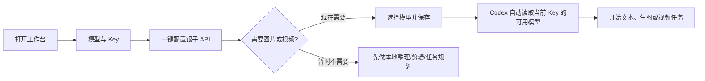
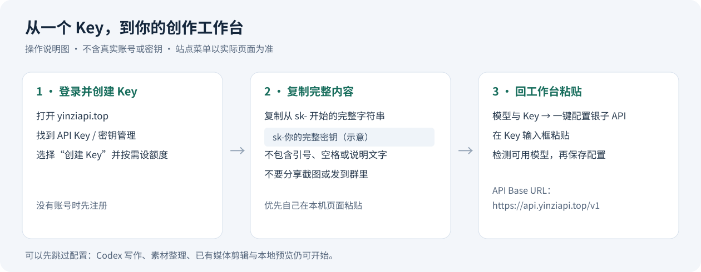

# 模型与 Key 新手图文说明

这页给第一次使用的人看。先完成最简单的一步就能开始；其他设置可以以后再学。进入工作台后，左侧打开 **模型与 Key**，页面上的入口顺序固定为：

1. **银子 API**（推荐首先配置）
2. **银子媒体站**（需要额外的图片或视频渠道时再配置）
3. **老李站点**（已有账号或备用渠道时再配置）



## 先配置银子 API

下面是说明图，展示应该复制和粘贴的内容（不是真实 Key）：



银子 API 统一提供文本、图片和视频模型入口。站点和访问端点分别是：

- 站点：<https://yinziapi.top/>
- 访问端点：`https://api.yinziapi.top/v1`

在工作台中点击 **一键配置银子 API**，按下面三步操作：

| 步骤 | 你要做什么 | 页面上会看到什么 |
| --- | --- | --- |
| 1 | 打开 <https://yinziapi.top/>，注册或登录 | 银子 API 站点首页 |
| 2 | 进入 **API Key / 密钥** 页面，点击 **创建 Key**（或同义按钮） | 看到新建密钥；具体显示方式以站点当前页面为准 |
| 3 | 复制完整的 `sk-...` 字符串，回到工作台粘贴 | 输入框标题为“银子 API Key（推荐先填这个）” |

同时确认 **API Base URL** 是 `https://api.yinziapi.top/v1`。如果站点给你的地址不同，以站点显示的访问端点为准。点击 **检测并自动配置** 后，系统只读读取当前 Key 可以使用的模型，不会因为保存配置而生成图片或视频。

> 复制的是完整 Key，包括开头的 `sk-`，不要复制网页上的引号、空格或说明文字。Key 不要发到群聊、截图、Git 仓库或普通日志里。

### 配置后能做什么

配置了什么，就能按当前 Key 的实际权限调用什么：

- 有文本模型：写脚本、故事、口播词、分镜说明、字幕和产品文案；
- 有图片模型：生成宣传图、角色/场景/道具图，或根据参考图做变体；
- 有视频模型：生成镜头、广告片段、教程片段和动态素材；
- 保存多个配置后，可以为文本、图片和视频分别准备备用模型，并填写备注，例如“4K 图片”“低价视频”“人文社科文本”。

最终可用模型以当前 Key 的实时响应为准。公开目录是参考，付费任务提交前 Codex 仍会再次核对能力、价格和余额。

## 不配置 Key 也能做什么

不配置也可以使用工作台完成本地工作：导入和整理素材、查看已有成果、剪辑已有视频、字幕与音频处理、批量规划、任务计划、3D 预览和手动节点。需要调用云端文本、图片或视频模型时，Codex 会明确告诉你当前缺少哪一种配置，并给出下一步。

当你提出“帮我生一张图”或“生成一段视频”而没有对应 Key 时，Codex 会说明：

1. 当前任务需要图片模型或视频模型；
2. 目前没有检测到对应配置，因此还没有提交付费请求；
3. 去 **模型与 Key → 一键配置银子 API**，或把站点、端点、Key、模型名和备注直接发给 Codex 代填；
4. 配置完成后会解锁哪项能力；
5. 在配置完成前，仍然可以先做素材整理、脚本计划或已有媒体编辑。

## 银子媒体站和老李站点

这两个入口用于额外渠道或备用配置，不影响先用银子 API：

- **银子媒体站**：在“模型与 Key”中点击 **配置银子媒体站**，填写站点要求的图片或视频配置。适合需要独立的图片/视频额度、模型或备用线路时使用。
- **老李站点**：点击 **配置老李站点（三 Key）**，按页面提示分别填写文本、图片、视频 Key。适合已经拥有该站点账号的用户。

文本模型最多可保存一百份，图片和视频也可以保存多份，并可填写备注。Codex 会根据任务类型、用户偏好、模型能力和当前可用性选择合适配置；你也可以在配置列表中手动指定默认项、停用不想使用的配置或删除旧配置。失败时系统会先查询原请求状态，再决定是否使用已保存的备用配置，避免重复提交和重复扣费。

## 直接让 Codex 代填

你不必自己打开设置页。可以在对话中发送：

```text
请帮我配置：
站点：https://yinziapi.top/
访问端点：https://api.yinziapi.top/v1
Key：sk-（完整内容）
文本模型：模型名（可留空）
图片模型：模型名（可留空）
视频模型：模型名（可留空）
备注：例如“主账号，优先质量”
```

Codex 会先打开工作台，检查运行时，再把配置保存到本机配置数据库，并告诉你保存了哪一类配置。本项目不把 Key 写入计划、任务回执、源码或普通导出。若你在 Codex 对话发送 Key，它会出现在该对话记录中；建议优先在本机页面粘贴。若不希望在聊天中发送完整 Key，也可以只说“打开模型与 Key”，自己在页面粘贴。

## 高级设置怎么处理

第一次使用可以全部保留默认值。熟悉后再逐项配置：文本、图片、视频的独立 Key；模型名；质量、分辨率、费用和能力备注；备用配置；质量优先、均衡、速度优先三档。你可以随时问 Codex：**“请列出我当前配置能做什么，哪些高级项值得修改？”**，它会按当前任务给出清单，不要求一次学会所有选项。

## 出现错误时看哪里

- 工作台地址由启动器动态选择，端口被占用时会自动退避；以 Codex 返回的 `frontend_url` 为准，不要手动猜端口。
- 页面右上角和“任务与计划”会显示当前动作、最新更新时间、等待原因、错误处理和下一步。
- 任务状态不明时不要再次点击生成；把任务详情发给 Codex，它会先按原任务 ID 查询，再决定恢复、下载或改用备用配置。
- 如果 Key 无效、余额不足或模型没有权限，先回到“模型与 Key”修正配置；已经提交的请求会保留原始回执，不会被假装成成功。

> 安全提醒：Key 等同于账号密码。只在本机工作台或受信任的 Codex 对话中使用，定期在银子 API 站点撤销不用的 Key。
